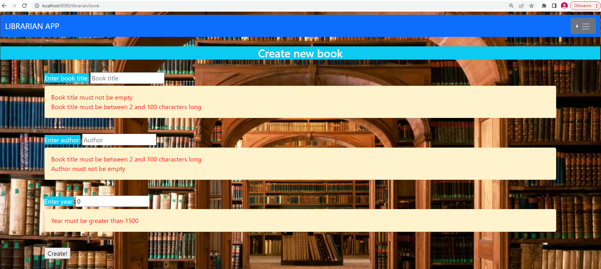
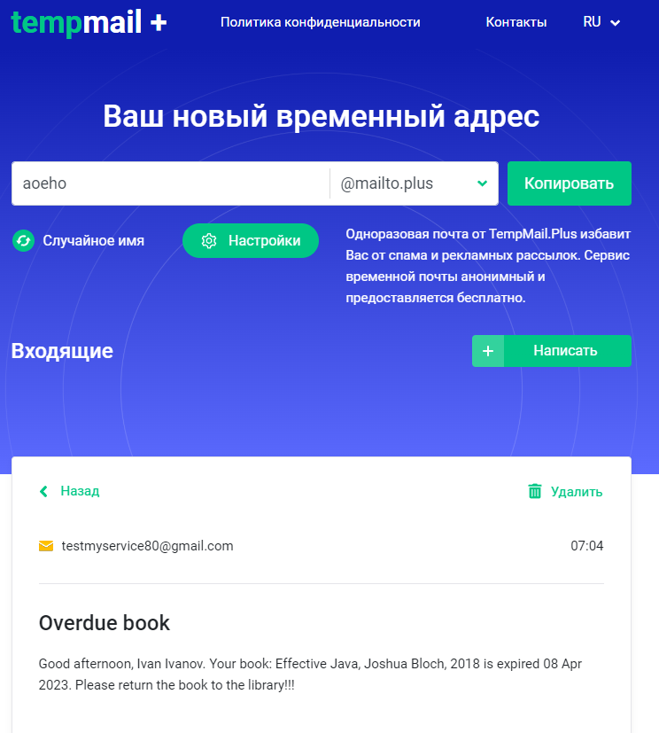

**Project**: library web application.

**About the project:** the library app is an app for automate the work of the library, accounting for all readers, books, controlling the timing of taking books and returning them to the library.

The project uses the following technologies:
1. **Docker** - for application deployment PostgreSQL, to work with the database, automatic initialization of the database.
   
2. **Liquibase** - to track, manage, and enforce database schema changes.
3. **Maven** - to automate the assembly of projects.
4. **Spring Boot** - creating a backend part of the application.
5. **HTML** - creating a custom part of the application (frontend).
6. **Thymeleaf** - allows to store html templates on the server side and issue them by calling a specific code.
7. **CSS** - for describing the appearance of a document, it is responsible for how web pages look: the color of the background and decorative elements, the size and style of fonts.
8. **JavaScript** - to write a script to search for books and readers on the front.
9. **Log4j2** - is responsible for writing information to log files based on the specified logging levels. The main task of the logger is not to miss the event that needs to be written to the log file.
   
10. **Mapstruct** - to generate code for passing data between different entities in the program. It helps to map objects from one entity to another.
11. **Validation** - to check the correctness of entering user data.
    

    
12. **Spring Security** - to ensure the safe use of the application. Granting rights and possible actions, taking into account the role that the user has.
    
13. **Swagger** - for documenting application endpoints.
    
14. **Localization** - change the application language. Two languages are available: English and Russian.
       

      
15. **Spring-boot-starter-mail** - work with e-mail, email confirmation during registration and sending an email if the book is overdue.
    
    
    
16. **Testing** - unit tests to test the service layer and integration tests to test the controller layer using Mockito framework.

    